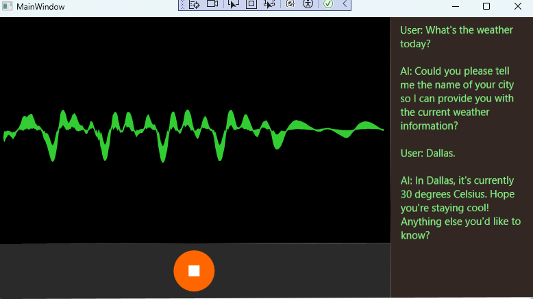

# 项目名称
OpenAI.RealtimeApi.Dotnet.SDK

## 项目简介

Realtime 控件 是一个用于实时语音识别和语音合成的控件，能够通过语音输入进行文本识别，并通过文本生成语音响应。该控件可以用于桌面应用程序，集成 OpenAI 和其他相关服务，提供流畅的语音交互体验。

此控件适用于需要语音交互的应用场景，如虚拟助手、语音识别系统、智能客服等。

## 目录

- [功能概述](#功能概述)
- [安装和配置](#安装和配置)
- [使用方法](#使用方法)
- [功能演示](#功能演示)
- [许可证](#许可证)

## 功能概述

Realtime 控件 提供以下主要功能：

- 实时语音识别：将用户的语音实时转换为文本，支持连续语音输入和反馈。
- 文本转语音：将 AI 或其他文本信息转换为语音并播放。
- 多语言支持：支持多种语言的语音识别。
- OpenAI 集成：集成 OpenAI API，支持智能对话和自然语言处理。
- 自定义功能：支持开发者自定义 API 调用和语音相关的功能。

## 安装和配置

### 系统要求

列出项目运行所需的基本环境要求：

- 操作系统：Windows 10 或更高版本
- .NET 版本：.NET 6.0 或更高版本
- 其他依赖：OpenAI API 密钥、NAudio等

### 使用方法

### 初始化控件

在 `Windows Forms` 应用中，你可以通过如下方式初始化控件并开始使用：

```c#
using Realtime.API.Dotnet.SDK.Core.Model;

public partial class MainForm : Form
{
    private RealtimeApiDesktopControl realtimeApiDesktopControl = new RealtimeApiDesktopControl();

    public MainForm()
    {
        InitializeComponent();
        Init();
    }
    
    public void Init()
    {
        realtimeApiDesktopControl.SpeechTextAvailable += RealtimeApiDesktopControl_SpeechTextAvailable;
        realtimeApiDesktopControl.PlaybackTextAvailable += RealtimeApiDesktopControl_PlaybackTextAvailable;
    }
    
    private void MainFrom_Load(object sender, EventArgs e)
	{
    	string openAiApiKey = Environment.GetEnvironmentVariable("OPENAI_API_KEY") ?? "";
    	realtimeApiDesktopControl.OpenAiApiKey = openAiApiKey;
	}

    private void RealtimeApiDesktopControl_SpeechTextAvailable(object sender, TranscriptEventArgs e)
    {
        // 处理语音识别结果
        Console.WriteLine($"User: {e.Transcript}");
    }

    private void RealtimeApiDesktopControl_PlaybackTextAvailable(object sender, TranscriptEventArgs e)
    {
        // 处理语音播放结果
        Console.WriteLine($"AI: {e.Transcript}");
    }

    private void btnStart_Click(object sender, EventArgs e)
    {
        // 启动语音识别
        realtimeApiDesktopControl.StartSpeechRecognition();
    }

    private void btnStop_Click(object sender, EventArgs e)
    {
        // 停止语音识别
        realtimeApiDesktopControl.StopSpeechRecognition();
    }
}

```

### 功能演示

1. **语音识别**：点击 "Start" 按钮，控件开始监听用户的语音并实时转换为文本。
2. **语音文本**：通过调用 `RealtimeApiDesktopControl.PlaybackTextAvailable`，将输出AI语音的文本信息。
3. 


## 许可证

本项目使用 [MIT 许可证](LICENSE) 进行授权。